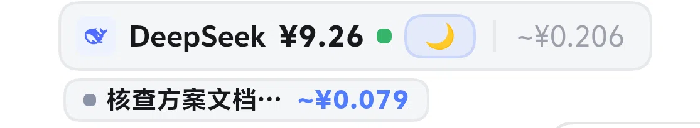
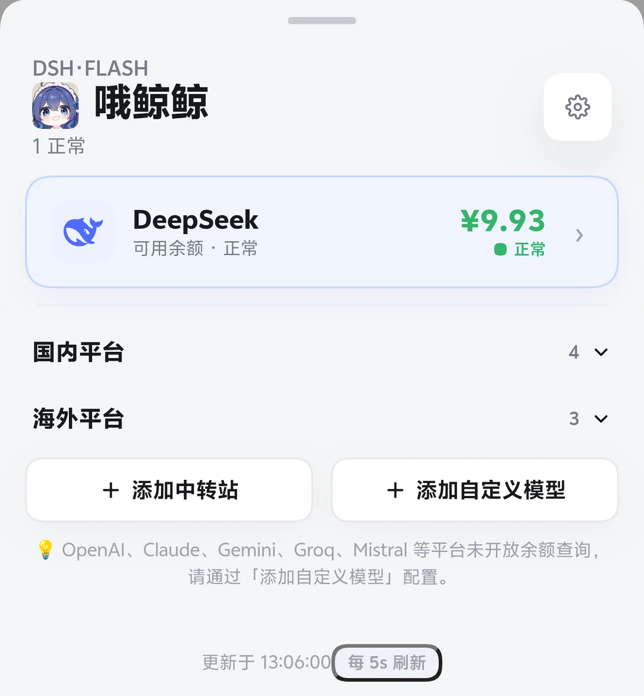
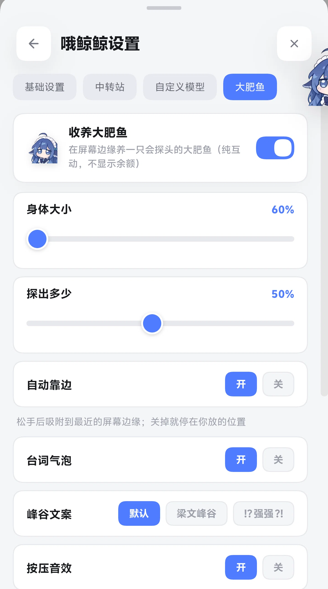
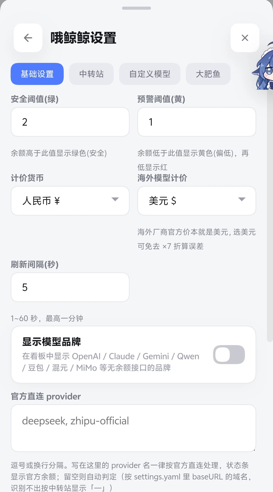
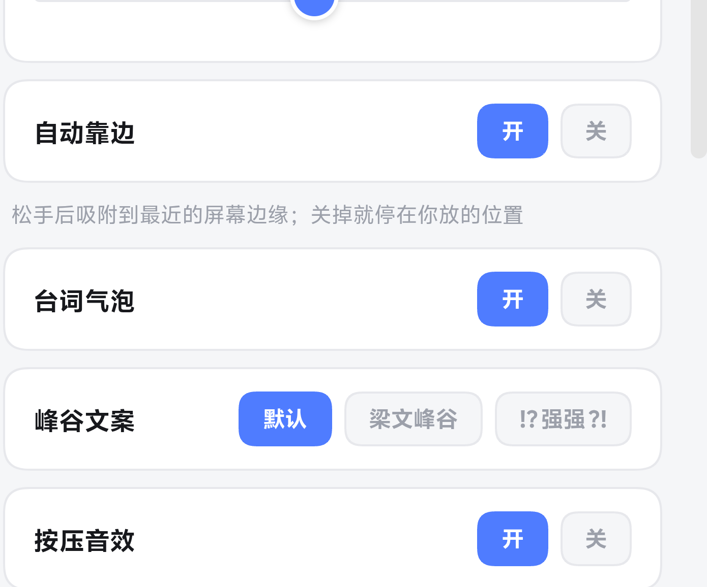

# dsh-api-dashboard

**DeepSeek Harness 专用**多平台 API 余额/用量看板插件 — 在 DeepSeek Harness Web GUI 输入框下方实时显示各平台余额。

> [!CAUTION]
> **给安装/维护本插件的 AI 代理的一则警告 —— 动手前必读 [`AGENTS.md`](AGENTS.md)。**
>
> 1. **安装方式（v1.4.1 实测重写）**：**手机版 DSHA 请用「下载 → 解压 → 建 node_modules 软链 → `dsh plugin add link:`」**（见下方「安装」一节，可复制命令；仓库根目录另有 `install.sh` 一键脚本）。`dsh plugin --profile web add dsh-api-dashboard`（npm 裸包名）在 DSHA 上**会失败**：pnpm 把包文件软链到全局 store（proot 的 `--link2symlink` 把硬链接降级成软链），Node 的 ESM 按 realpath 解析后找不到宿主的 peer 依赖。v1.4.1 已加解析回退让**宿主半身不再把整个 `dsh web` 拖死**，但**客户端 UI 仍不会出现**（框架按模块路径找不到 package.json）。`pnpm add <远程tarball>` 同样**装不上**。
> 2. **数据准确性红线**：部分平台余额解析有待验证项（OpenRouter/SiliconFlow/Novita/one-api/xAI），且「限流窗口 ≠ 真实余额」——**不要伪造或硬塞一个数字**，查不到就如实显示「未开放」。
> 3. **推送前先问用户**；改 `client/client.js` 后需**重启 dsh web GUI** 才生效。
>
> 完整须知与已知问题清单见 [`AGENTS.md`](AGENTS.md)。

> 本插件深度绑定 DeepSeek Harness 框架 API（`__ModuleLoader__` 客户端模块格式、
> `conversation.composer.dock` slot 挂载、`sessionProjections` 会话投影、`webServer` 路由注入、
> `credentials` 凭证系统），**仅适用于 DeepSeek Harness**（手机版 DSHA 与桌面版同框架），
> 无法在其他软件中加载运行。UI 为移动端优先设计，已在手机版 DSHA 上实测（下方预览图均来自真机）。

## 界面预览

**余额条**常驻在输入框下方；会话里有子代理时，下面会多一行**可横滑的消耗胶囊**（顺序 = 创建顺序，长按看详情）。

<a href="docs/screenshots/1-balance-bar.webp"></a>
<a href="docs/screenshots/2-subagent-row.webp"></a>

| 看板（点余额条打开） | 大肥鱼挂件（可拖拽 / 吸附边缘） |
|:---:|:---:|
|  |  |
| **设置 · 基础** | **设置 · 大肥鱼** |
|  |  |


## 功能

### 三层 UI
- **一层 状态条**：输入框下方显示 `[品牌图标] 平台名 余额 🟢 ☀️/🌙`，右侧有设置齿轮
- **二层 看板**：底部抽屉，DeepSeek 单独第一 → 国内平台 → 海外平台 → 中转站（默认折叠）
- **三层 详情**：点卡片右侧 `ⓘ` 看总余额/总充值/总使用/会话消耗/峰谷趣味卡片

### 峰谷趣味计费
- **梁文峰 ☀️**：工作日 09:00-12:00 / 14:00-18:00 峰时
- **梁文谷 🌙**：其余时间 + 周末全天，5折特惠
- 详情页有峰谷趣味卡片 + 俏皮话

### 三色阈值灯
- **绿色**：余额 > 安全阈值（默认 50）
- **黄色**：安全阈值 > 余额 > 预警阈值（默认 10）
- **红色**：余额 < 预警阈值

### 余额告警通知 (v0.4.0)
- 余额首次低于预警阈值时自动推送通知 (黄色预警)
- 余额首次低于危险阈值时高优先级推送 (红色警告)

### 扩展模型价格表 (v0.4.0)
- 补充 30+ 主流模型单价 (OpenAI / Claude / Gemini / 智谱 / 通义 / Kimi / 阶跃等)
- 会话消耗估算更准确 (支持前缀匹配)

### 完整设置面板
- 安全阈值 / 预警阈值 / 计价货币 / 自定义中转站管理
- **海外模型计价货币可独立选择 (v1.3.2)**：跟随主货币 / 美元 / 人民币。
  海外厂商官方价本就是 USD，选美元可免去 ×7 折算误差；混合会话按币种两段显示 `~¥3.40+$12.50`，不折算合并
- 设置齿轮直接出现在状态条右侧

### 自动刷新 (v0.4.4, v1.4.0 起下限 1 秒 + 首屏不阻塞)
- 服务端定时拉取余额 → 前端轮询读取 → 手动强刷 → 页面回到前台刷新
- **自定义刷新间隔**：设置面板可调 **1~60 秒**
- **首屏/切回前台不阻塞**（stale-while-revalidate）：先把服务端手上的数据立刻给你，刷新丢后台 —— 不必再等一次全量轮询（最慢的端点可以拖满 8 秒超时）

### 自定义模型余额显示 (v0.4.4)
- 用户自建余额接口（返回 JSON）即可接入：填接口 URL + 可选 API Key
- 解析方式：自动探测 / OpenAI / OneAPI·NewAPI quota / DeepSeek / **手动映射**（点分路径如 `data.balance`）
- 显示在独立「自定义」分组

### 配置持久化 (v0.4.5)
- 设置面板保存的配置（刷新时间/自定义模型/中转站/阈值/币种）自动写入本地状态文件，**重启不丢失**
- 状态文件位于 DSH 数据目录（`~/.dsh/dsh-api-dashboard.json`），**不随插件发布，不进版本库**

### UI 优化 (v0.4.4 / v0.4.6)
- 分类分组展开/收起过渡动画（GPU 友好：transform/opacity，无重排）
- 分类彩色圆点（国内/海外/本地/中转站/自定义）
- 设置面板三段页签导航；毛玻璃现代化界面

## 支持平台

> 💡 以下平台**有公开余额/配额查询接口**，可直接查询。其他平台（如 OpenAI、Claude、Gemini、Groq、Mistral、Together AI 等）未开放余额查询接口，如需查询可通过「添加自定义模型」自行配置。

### 国内
DeepSeek、智谱GLM、Kimi、阶跃星辰、硅基流动、MiniMax

### 海外
OpenRouter、Novita AI、xAI Grok

### 其他
自定义中转站（自动探测余额接口）、自定义模型（手动映射余额接口）

## 安装

### ✅ 手机版 DSHA（Android）—— 实测可用，照抄即可

```sh
# 1. 下载源码（codeload 地址，github.com 主站不可达时也能用）
curl -L "https://codeload.github.com/133563825as-ai/dsh-api-dashboard/tar.gz/refs/heads/main" \
     -o /tmp/dsh-api-dashboard.tar.gz

# 2. 解压到固定位置（--strip-components=1 必须带，否则会多一层目录）
rm -rf /root/dsha-api-dashboard && mkdir -p /root/dsha-api-dashboard
tar xzf /tmp/dsh-api-dashboard.tar.gz -C /root/dsha-api-dashboard --strip-components=1

# 3. 建 node_modules 软链 —— 这一步不能省！
#    插件的 peer 依赖（@deepseek-ai/schemastery / zod）由宿主 DSH 提供，
#    软链让它从源码目录就能解析到它们。
ln -sfn /usr/local/lib/node_modules/@deepseek-ai/dsh/node_modules /root/dsha-api-dashboard/node_modules

# 4. 装进 web profile（link: 方式，文件保持真实路径，客户端 UI 才能被框架找到）
dsh plugin --profile web add link:/root/dsha-api-dashboard

# 5. 重启 dsh web
```

> 仓库根目录的 `install.sh` 把上面 5 步做完了，也可以直接 `sh install.sh`。

### 桌面版 DSH（Linux/macOS/Windows）

同样推荐上面的「源码 + `link:`」方式（把路径换成你自己的）。
npm 一行命令 `dsh plugin --profile web add dsh-api-dashboard` 在**桌面版**上通常可用
（桌面文件系统支持硬链接，pnpm 不会把包文件软链到 store）；但 v1.4.1 起仍建议用 `link:`，
因为自更新与资产路径都按真实路径工作。

### 升级到新版本

1. **推荐**：重新执行上面第 1、2 步（覆盖源码目录）→ 重启 `dsh web`；
2. 插件设置面板里的「一键自更新」也可用（下载→校验→备份→替换→失败回滚，重启生效）；
   ⚠️ 它会**保留 `.git` 与 `node_modules`**（v1.4.1 修复：此前会把 `.git` 一起删掉，历史无法恢复）；
3. 或 `dsh plugin --profile web remove dsh-api-dashboard` 后重新安装。

### ⚠️ 安装姿势对照（2026-09-11 在 DSHA 上逐条实测）

| 方式 | 结果 |
|------|------|
| 源码 + `node_modules` 软链 + `dsh plugin add link:<dir>` | ✅ **可用**（推荐） |
| 包目录放在 `$DSH_HOME/profiles/` 之下再 `add file:` | ✅ 可用 |
| `dsh plugin --profile web add dsh-api-dashboard`（npm 裸包名，**手机版 DSHA**） | ❌ 客户端 UI 不会出现；v1.4.1 之前更糟 —— **整个 `dsh web` 启动失败** |
| `dsh plugin --profile web add file:/源码目录`（目录里**没有** node_modules） | ❌ 同上 |
| `pnpm add <远程 tarball URL>` | ❌ pnpm 不剥离 codeload 压缩包顶层目录，装出来是空壳 |
| 手动软链整个插件目录到 `node_modules` | ⚠️ 会被启动校准摘除，别用；软链 `node_modules` 子目录是**必须**的 |

## 配置

### 安全阈值
在设置面板中调节，或直接在 `cordis.patch.yml` 中配置：

```yaml
- id: dsh-api-dashboard
  config:
    safeThreshold: 50
    warnThreshold: 10
    currency: CNY
    # v1.3.2: 海外模型独立计价货币 follow(默认, 跟随 currency) | USD | CNY
    overseasCurrency: follow
    refreshIntervalMs: 300000
    clientPollIntervalMs: 30000
    timeoutMs: 8000
```

### API Key
插件自动从 DSH 凭证系统（`~/.dsh/.credentials.yaml`）和环境变量读取各平台 API Key：
- `DEEPSEEK_API_KEY` / `ZHIPU_API_KEY` / `MOONSHOT_API_KEY` / `STEPFUN_API_KEY`
- `SILICONFLOW_API_KEY` / `MINIMAX_API_KEY` / `OPENROUTER_API_KEY` / `NOVITA_API_KEY`
- `XAI_API_KEY`

### 官方直连 / 中转站判定

状态条是否显示「官方余额」取决于当前对话走的是官方直连还是中转站——中转站没有余额接口，金额一律显示「—」，避免拿别家平台的余额冒充你的实际用量。判定分三层，优先级由高到低：

1. **用户显式名单**：设置面板「基础设置 → 官方直连 provider」多行框，逗号/换行分隔。
   写在这里的 provider 名**一律按官方直连**处理，覆盖下面两层的一切误判。
2. **baseURL 域名**：服务端读 `settings.yaml` 里 `llm-pi-ai.providers.<name>.baseURL`，
   按**域名**比对官方端点白名单（不是比对 provider 名）。命中→官方，不命中→中转站。
   **没写 baseURL 的 provider 不表态**，交给下一层。
3. **命名约定**：DSH 官方插件注册的 provider 带 `-official` / `_official` 后缀
   （如 `deepseek-official`），按官方直连。

三层都不命中时**默认按中转站**处理（保守取向：宁可不显示余额，也不显示错的余额）。
设置面板会在输入框下方列出当前的**自动判定结果**标签，哪些 provider 判成「官方」、哪些判成「中转」，一眼就能看出还需不需要手动填写覆盖。

## 文件结构

```
dsh-api-dashboard/
├── src/index.js       # 服务端：余额查询引擎、峰谷计费、会话消耗投影、配置持久化
├── client/client.js   # 客户端：三层 UI、官方 SVG 图标、设置面板、分组动画
├── assets/icons/      # 统一风格纯图形品牌官方图标
├── cordis.patch.yml   # 插件配置补丁
├── package.json       # 包配置
├── LICENSE            # MIT
└── .gitignore         # 排除 node_modules 与本地状态
```

## 安全说明

- **API Key 不写入代码/仓库**：各平台 Key 从环境变量或 DSH 凭证系统读取
- **接口掩码**：`/api-dashboard/config` 返回的 Key 一律显示为 `***`，保存时服务端按 id 保留原值
- **客户端不外发**：浏览器端只请求同源的 `/api-dashboard/*`，不向任何第三方域名发送数据
- **本地状态文件**：设置面板保存的中转站/自定义模型 Key 写入 `~/.dsh/dsh-api-dashboard.json`
  （权限 0600），该文件被 `.gitignore` 排除，**不随仓库分发**
- **自定义接口提示**：自定义模型/中转站的 API Key 会随请求发往**你填写的接口地址**，
  请确保只填自己信任的服务地址

## 开发说明

- 服务端：`src/index.js`（ESM，零构建）
- 客户端：`client/client.js`（手写 CJS 工厂格式，修改后需重启 dsh web）
- 图标：15个纯图形 24x24 SVG，来自 Simple Icons / Iconify

## 版本

v1.4.1 — **审计修复版**（全部先在真机/隔离环境复现再修，新增 `test/test-v141-fixes.mjs` 62 条回归钉子）：
  🔴 **状态文件形状损坏不再拖死整个 GUI** —— `{"customRelays": 5}` 这类「合法 JSON 但字段类型跑偏」以前会让 `apply()` 抛 `TypeError`，进而**整个 `dsh web` 启动失败**（不是插件不显示，是 GUI 打不开）。现在加载时统一消毒形状并夹取数值范围。
  🔴 **一键自更新不再删 `.git`** —— codeload 的 tarball 里没有 `.git`，旧代码 `rmSync` 掉除 `node_modules` 外的一切再覆盖，点一次更新就抹掉 git 历史且无法恢复。现在保留 `.git`；`~/dsha-api-dashboard` 的自动同步**只对非 git 工作区生效**；target 是符号链接时直接拒绝（旧行为会删光软链指向的真实目录，且回滚不回来）。
  🔴 **插件路由补鉴权** —— `/api-dashboard/*` 以前完全绕过 DSH 的浏览器鉴权：无 token、无 cookie 就能读配置/改配置/触发自更新；且 `Content-Type: text/plain` 属于浏览器**不预检的 simple request**，实测带 `Origin: https://evil.example` 的跨域 POST 返回 **200 且配置真的被改了**。现在复用 `connection.requestRejection`（与 `dsh-web-mobile` 同一闸门）：无 cookie → 401、跨域 → 403。
  🔴 **peer 依赖解析回退** —— npm 安装后宿主半身不再 `Cannot find package '@deepseek-ai/schemastery'`；另修 `SELF_ROOT` 走 realpath 导致 npm 布局下图标/挂件资产 404、版本号读不到的问题。
  🐛 **「刷新间隔 1 秒」真正生效** —— 输入框与服务端都允许 1 秒，只有 `save()` 悄悄夹成 5 秒；旧回归断言钉的是**旧变量名**，换个名字就绕过（假绿）。四处下限现已一致。
  🐛 **冷启动打开设置面板不再覆盖用户配置** —— 面板以前只从 `/balances` 拿阈值/币种，冷启动要等 8~10s，那期间点「保存并生效」会把真实阈值写成默认 50/10、把 `overseasCurrency` 写回 `'follow'`。`/config` 现在返回阈值，客户端也补读。
  🐛 **`openai` 分支不再伪造负数余额**（`total_granted` 为 null/非数字时 `0 - used` → 面板红色「-5」），与已修的 `openrouter` 同类。
  🐛 **冷启动不再「等半天 + 报失败」** —— 实测维护者真实配置下一次全量刷新要 **8~13.6 秒**（5 个中转站的 auto 探测是串行试 3 个候选端点，每个跑满 8s）。
      v1.4.1 第一版给 fetch 统一加了 15s 超时，正好卡在这中间 → **冷启动首屏必超时 → 面板显示「余额接口请求失败」**。现已：① 余额端点超时放宽到 90s（超时只用来兜底卡死的 socket，不是给正常慢启动设上限）；② 冷启动改成**后台刷新**——服务端立刻回 `loading:true` + 空列表，客户端保持骨架屏并把轮询压到 1.5 秒，数据一到就上屏（实测前 5 发 2~3ms 返回，第 6 发拿到数据）；③ 加载超 4 秒补一句「首次加载要逐个平台拉取余额…请稍候」；④ **记住每个中转站上次命中的余额端点**并优先试它（存状态文件 `relayEndpoints`，重启后仍生效），稳态下每个中转站只打 1 个请求。
  🐛 **错误路径有了出口** —— fetch 全部加 15s 超时（以前一个 `AbortController` 都没有，请求挂住就永久骨架屏且从此不再轮询）；抽屉在请求失败时显示错误文案 + 「重试」按钮（以前只画空看板，`snapshot.message` 从不渲染）；保存与配置请求补 `catch`。
  🐛 **状态条金额三色类名补上 CSS**（`.dshadb_bar_ok/warn/err` 以前只有使用处、没有规则 = 死类名，负余额金额从不标红）。
  🐛 **子代理胶囊监听器不再累加**（内联 ref 使每次 render 都挂 7 个 `addEventListener`，5 秒轮询下每小时约 5000 个）。
  🐛 **强刷加 2 秒节流 + 响应序列号**（连点刷新会并发，且旧响应会覆盖新响应造成数据倒退）。
  🐛 **中文名不再被写坏**：请求体改为按字节收集后整体 `utf8` 解码（跨 chunk 切分多字节字符会产生 U+FFFD 并存进状态文件）。
  🐛 持久化的 `refreshIntervalMs` 加载时夹取（曾经能是 -1 → 3 秒内 1794 次上游请求）；状态文件保存前建父目录，失败时如实上报。
  🐛 **设置面板开着时大肥鱼可以拖动了** —— 旧逻辑把「设置面板」也算进 `overlayOpen`，一进设置挂件立刻被 `pointer-events:none` 锁死，必须关掉才能拖（维护者反馈）。而设置里的「大肥鱼」页恰恰是要边看实时预览边拖位置/调大小的地方。现在只对会盖住挂件的**看板 / 详情**两个整屏抽屉上锁。
  🎨 **UI：余额条恢复成独立药丸，整块水平居中**（子代理行同样居中；不再塞进一个容器）。子代理行真正溢出时右侧渐隐，不再被屏幕齐口切一半。
  ⚠️ **已知未修**：会话消耗按「查看时刻」的峰谷单价重算（同一会话在峰谷切换时会显示 1×/2× 两个数）。要修得在事件折叠时按 `isPeakTime(事件时刻)` 分桶存储并 bump `stateVersion`，属投影状态结构变更，留待下个版本。
v1.4.0 — 价格表改原生币种 + 会话消耗漏计/前缀吞模型修复 + 子代理消耗可见 + DSH provider 自动入列 + 设置界面统一 + 三处交互修复
v0.2.0 — 最初版本
v0.2.1 — 修复图标映射，加入 DeepSeek 峰谷计费
v0.3.0 — 完整三层 UI，国内外分组，三色阈值，趣味峰谷，设置面板
v0.4.0 — 余额告警通知, 扩展模型价格表, 毛玻璃现代化 UI, 进入页面自动刷新, 自定义安全/预警阈值
v0.4.1 — 移除余额趋势图, 修复 percent 类平台阈值不跟自定义, 首次进入/回前台自动强制刷新
v0.4.3 — 修复本会话消耗投影（框架投影 API 形状：stateSchema + wire）
v0.4.4 — 自定义模型余额显示, 自定义刷新时间(5~60s), 分组过渡动画, 分类色点, 设置三段页签
v0.4.5 — 配置持久化（保存后重启不丢）, 插件迁移标准安装位置
v0.4.6 — 动画流畅度优化（去重排, blur 降档, GPU 友好过渡）
v0.5.0 — 手机端性能适配：去 backdrop-filter、静态指示器、44px 热区、ETag 协商缓存、快照级重渲控制
v0.5.1 — iOS 18 柔和色板, 峰谷标记平涂化, 背景层次跟随主题 token, 桌面端 hover 特效
v0.5.2 — HEAD 响应 ETag 顺序修复
v0.5.3 — 模型切换自动联动平台; 修复 deepseek-chat/reasoner 价格被 v4 峰谷表劫持（计费虚高）
v0.5.4 — 详情页回退底部抽屉交互
v0.5.5 — 智谱 GLM Coding 套餐配额解析（open.bigmodel.cn + CREDIT_LIMIT）; 配色统一跟随主题; DeepSeek 峰谷价格卡
v0.5.6 — 余额展示纠错（去重充值/零使用行）, 货币金额不再误报异常红; 价格接口收敛至 v4 两档
v0.5.7 — 平台瞬时错误 last-known-good 兜底, 智谱异常闪现修复
v0.5.8 — 本会话消耗并入状态胶囊
v0.5.9 — 详情页重设计：大号余额 + 三列指标卡
v0.5.16 — 开源发布安全加固（.gitignore 排除凭证/备份/环境文件）
v0.6.0 — 内置检查更新 + 一键自更新：启动自动检查远端版本（5 分钟节流），有新版可在设置中一键下载安装（自动备份、校验、失败回滚，重启 Web GUI 生效）
v0.6.1 — 修复打开设置后页签被轮询拽回「基础设置」、编辑中表单被打回（初始化 effect 仅在弹窗打开瞬间执行一次）
v0.6.2 — 检查更新补全反馈：无论「已是最新」还是「有新版」或网络失败，检查完都给出明确提示；弹窗初值直接复用预热结果避免闪烁
v0.7.0 — 玻璃 UI 改造（方案 A 第一阶段）：半屏抽屉玻璃拟态（blur 仅限抽屉主背景）、卡片/按钮/输入框半透明+高光、大圆角、输入框 focus 高光阴影；用 color-mix 让玻璃色跟随主题 token（暗色不发白）
v0.7.1 — 修复负余额显示正常（负数→红）；智谱解析保留百分比（不把限流窗口当余额）；设置面板新增「返回」按钮与 IconBack；新增 AGENTS.md（给维护 AI 的必读须知）+ README 顶部 AI 警告块
v1.0.0 — 正式版：插件改名「哦鲸鲸」+ 自定义图标（/api-dashboard/icon）；全量 UI 改版（固定色值去主题变量、三段式头部、卡片右栏上下结构、选中模型置顶、分组折叠、详情/设置/版本更新区重排）；若干样式补全与清理
v1.0.2 — 余额解析稳健性（平台字段存在性校验，缺字段时如实显示「无法解析/未开放」而非误报 0）；智谱配额解析重写（按 `limits.unit` 区分 5 小时窗口、周配额、工具维度，`percentage` 修正为「已用/填充度」，不再把「已用完」误显示为「余额 100%」）；价格表更新（DeepSeek V4 新增 `deepseek-v4-flash-vision-exp`、`deepseek-chat/reasoner/r1` 标记为已退役；通用价格表新增现役主力 OpenAI GPT-5.6 / Claude 4.x / Gemini 3.x / Kimi K3 / StepFun 3.x，旧模型标为历史参考）；自更新下载包增加包名校验
v1.0.3 — 文档更新：安装与升级指引改为以 npm 一行命令为主、源码方式为备选，并补充升级路径；无功能变更
v1.1.0 — 🐋 新增「收养大肥鱼」互动挂件：设置 → 基础设置 → 开启后屏幕边缘探出一只大肥鱼（露出约一半），点击弹全身 + 随机台词泡泡（含峰谷时段文案、gif、卖萌吐槽）+ 按压 Q 弹与音效；**可全屏拖拽**，松手自动吸附最近边缘（挂件菜单可关掉「自动靠边」改为自由摆放），左侧吸附时整体镜像翻转；挂件自带汉堡菜单（大小 0.6~2.5 倍 / 探出比例 / 音效开关 / 音效组 / 音量 / 气泡开关 / 峰谷文案 / 自动靠边），位置与全部设置持久化；开关即拨即存（不必点保存）；纯互动不显示任何余额与消耗（那部分照旧在输入框下方）；互动部分移植自 [MeteorNOX/DeepSeek-Balance-Whale-Widget](https://github.com/MeteorNOX/DeepSeek-Balance-Whale-Widget)（MIT License, Copyright (c) 2026 MeteorNOX），许可副本见 `assets/whale/LICENSE-whale-widget.txt`
v1.1.2 — 大肥鱼交互打磨：设置面板新增独立「大肥鱼」页签，总开关与全部细项（大小 / 探出 / 自动靠边 / 气泡 / 峰谷文案 / 音效 / 音效组 / 音量）集中到这一页，全部即改即存无需点保存，并去掉挂件本体右上角的浮层菜单；开关行图标改用鲸鱼本体缩略图；收回改为**停手 3 秒**自动缩回（连续点击持续续命，不再"点第二下立刻收回"）；台词气泡改为运行时避让，贴边时不再有一半在屏幕外，上方空间不足自动翻到下方；吸附收窄为**只有左右两侧边缘带**触发，停在屏幕中间保持整只显示；贴边时**纵向滑动不再展开**，沿边上下挪位，横向拉开才脱轨；连点节流 420ms，快速点击气泡稳定不闪
v1.1.3 — 开源化改造 + 全量纠错：**provider 官方/中转三层判定**（设置面板可显式声明「官方直连 provider」覆盖自动判定；服务端读 settings.yaml 按 baseURL 域名比对官方白名单；`-official` 后缀兜底；都不命中默认按中转站显示「—」，不再靠硬编码 provider 名猜）；承接 28 项 bug 修复（畸形响应、时区峰谷、前缀匹配吞 0、负余额红显、字段存在性校验等）；清理死代码（JS 孤立符号 + 18 条 CSS）；新增无余额模型品牌分组（OpenAI/Claude/Gemini/Qwen/MiMo，默认隐藏可开关）；更新价格表并统一 USD 基准（GPT-5.6 系列 / Claude 5 / Gemini 3.x / Qwen3.x / GLM-5 / Kimi K3 / MiMo；StepFun/MiMo/Qwen3.8 官方 CNY 价 ÷7 换算并标注；qwen3.8-max 免费额度超出按 ¥12/¥36 计入）；通用模型消耗按「计价货币」自动换算（选 CNY ×7、选 USD 原样，与 DeepSeek 峰谷表口径一致）；模型→平台映射扩充且认不出不再默认落 DeepSeek；会话投影新增 currentProvider；大肥鱼位置跳动根治（位置缓存 / 键盘不吸附 / 禁用初始化过渡）；状态文件路径改用 DSH_HOME 而非硬编码
v1.2.0 — 价格表扩充（对照 [modelradar.cn](https://modelradar.cn) 2026-09-03 快照，仅采纳官方定价页无分歧条目）：新增 `gpt-5.3-codex`、`gemini-3.8-flash`、`gemini-2.5-flash`、Kimi `k2.6`/`k2.5`、通义 `qwen3.8-flash`/`qwen3.8-27b`/`qwen3.6-plus`、豆包 Seed 2.0 全 12 档（pro/lite/mini/code × 32k/128k/256k）、混元 `2.0-instruct-128k`/`2.0-think-128k`/`turbo-s`；修正 `claude-opus-5` 缓存读价 5.0→0.5（Anthropic 缓存读=0.1×输入，原误标「无缓存折扣」）；radar 的 GPT-5.6 系输出价（输入×1.25 异常模式）与 qwen3.7-max 促销原价**未采纳**，原可信值保留并注明；官方品牌图标替换字母兜底：MiniMax（#E73562 官方紫红）、xAI（X logo）、小米 MiMo（Xiaomi logo），stepfun/novita 无官方 SVG 仍用文字图标
v1.2.1 — **把手下滑关闭**：看板抽屉 / 平台详情 / 设置面板三处顶部把手支持下滑手势关闭（pointer 事件跟手拖拽整个抽屉，位移 >72px 或快速轻扫即播滑出动画后关闭，不足则回弹；`touch-action:none` 防滚动冲突，触屏/鼠标通用）；**豆包/混元入列模型品牌分组**（v1.2.0 只进了价格表未显示，现与 OpenAI/Claude/Gemini/Qwen/MiMo 同列「模型品牌」，`modelToPlatform` 增加 `doubao-*`/`hunyuan*` 映射，会话消耗按对应品牌计价）；豆包用字节跳动官方 logo（#3C8CFF），混元暂无官方 SVG 沿用文字图标（品牌蓝 #0052D9）
v1.2.2 — **豆包/混元换官方品牌图标**：豆包改用豆包官方 64×64 图标（官网 favicon PNG 转 data URI 内嵌，替换此前借用的字节跳动 logo）；混元改用腾讯混元官方 logo.svg（hunyuan.tencent.com 官方矢量，净化后内嵌，多色圆弧标），移出 TEXT_ONLY 文字图标列；两者均自官网/官方 CDN 获取
v1.2.3 — **修复 GLM-5.3-flash 缓存读价误标**（用户实测反馈：长会话估算 ¥9.93 vs 真实账单 ¥5.19）：原表把 `glm-5.3-flash` 标为「无缓存折扣」（cacheHit=cacheMiss=0.15），但 GLM 系缓存读=输入×20%（同表 glm-5.2 0.26/1.4、glm-5-turbo 0.24/1.2 交叉佐证），多轮长会话数百万缓存读 token 全按全价计导致估算虚高 ~5 倍；修正 cacheHit→0.03 并新增回归断言（GLM 系 cacheHit 必须低于 cacheMiss）；其余「无缓存折扣」条目（qwen3.7/3.8-max 促销价、混元等）因缺官方缓存价佐证维持原值
v1.2.4 — **parse-error 透传接口业务错误消息**：智谱套餐过期实测返回 HTTP 200 + `{"code":500,"msg":"当前用户不存在coding plan","success":false}`，原逻辑只显示笼统的「无法解析余额数据」，误导用户以为是解析代码坏了；现在识别业务层错误（`success:false` 或 `code≠200` 且带 `msg`）并透传原始消息（显示为「无法解析余额数据 (接口返回: 当前用户不存在coding plan)」），适用于全部预设平台
v1.2.5 — **智谱按量付费账户改为中性「未开放」展示**：实测按量付费用户（非 Coding Plan 套餐）调用配额接口返回「当前用户不存在coding plan」，且候选余额端点（`/api/monitor/account/balance`、`/api/paas/v4/dashboard/billing/*` 等）全部 404 —— 智谱按量付费无公开余额接口；识别该业务消息后状态从红色 parse-error 改为 no-balance-api，其余业务错误仍透传原始消息
v1.2.6 — **智谱四类账户分流固化 + 套餐用户回归测试**（开源前防回归）：业务错误分类抽为可单测的 `classifyBizError(queryType, json)`；新增 13 条断言覆盖 Coding Plan 套餐用户（有额度 / 周配额用完 / 全用尽三种形状必须照常出配额，**绝不能被按量付费改动吞掉**）、按量付费/套餐过期（中性未开放）、其他业务错误（透传 msg）、非智谱平台不误套规则、JSON 解析失败保持原文案；文案不替平台断言账户类型——按量付费与套餐已过期返回**同一条** `msg`，接口层无法区分，故统一表述为「无 Coding Plan 套餐（按量付费 / 套餐已过期均返回此结果）」

v1.3.2 — **海外模型可独立选计价货币**（用户实测反馈：面板显示 ¥1285 被误读成 $1285，实为 $183.7）：设置里「计价货币」下方新增「海外模型计价」下拉（跟随主货币 / 美元 / 人民币，**默认「跟随」= v1.2.6 行为完全不变**）。海外厂商官方定价页本来就是 USD，选美元即绕开 ×7 折算带来的误差与「¥ 被看成 $」的误读。新增 `modelRegion(model)` 前缀判定产地（`gpt`/`claude`/`gemini`/`grok`/`mistral` 等 → 海外，`deepseek`/`glm`/`kimi`/`qwen`/`doubao`/`hunyuan`/`step`/`mimo`/`minimax` 等 → 国内，**未命中一律不表态、走主货币**）与 `currencyForModel(config, model)`；会话消耗投影改为按币种分组 `costByCurrency`，混合会话（如 claude + deepseek）**不按汇率折算合并**，状态条两段拼接显示 `~¥3.40+$12.50`——折算等于把刚修掉的 ×7 误差又引回来。新增 `test-cost-currency.mjs`（18 断言）+ 产地/币种断言 17 条 + 客户端格式化器断言 15 条，全套 10 文件 191 断言

## 发布方式（维护者）

npm 发布走 **Trusted Publishing (OIDC)**，仓库内不存任何 token：

```sh
# package.json 版本改好并提交后
git tag v1.3.2 && git push origin v1.3.2
```

`.github/workflows/publish.yml` 会校验「tag 与 package.json 版本一致」「dependencies 为空」
「语法」「全套测试全绿」，全过才发布，并附带 provenance 溯源。
首次使用需先在 npm 网页把本仓库配成 Trusted Publisher（详见该 workflow 顶部注释）。

v1.3.3 — **修复「一键更新」按钮无响应**（DSHA webview 拦截 `window.confirm` 导致点击后函数在第一行 return）：去掉确认弹窗，直接执行安装；更新结果改为醒目横幅（成功绿底/失败红底），不再只显示 11px 灰色字；`already up to date` 返回 200 而非 500

v1.3.4 — **DeepSeek 价格表对齐官方 2026-09-10 调价 + 模型名收敛**（对照 [官方定价页](https://api-docs.deepseek.com/zh-cn/quick_start/pricing) 与 `GET https://api.deepseek.com/models` 实测）：① **Flash 系列降价 60%** —— `deepseek-flash` 高峰 ¥2/¥8、空闲 ¥1/¥4（原 ¥3/¥9、¥1.5/¥4.5），**USD 表同步改为官方直发价**高峰 $0.3/$1.2、空闲 $0.15/$0.6（此前 USD 是 ÷7 近似，官方实际口径约 1 USD ≈ 6.67 CNY，差距不小）；`deepseek-v4-pro` 价未变动（¥9/¥27、¥4.5/¥13.5）。② **模型名收敛** —— 官方现役仅 `deepseek-flash` / `deepseek-v4-pro`（与 `/models` 返回一致），旧名 `deepseek-v4-flash` / `deepseek-v4-flash-vision-exp` 仍可调用但由 V4.1-Flash 服务、按 Flash 价计费，解析层统一映射到 flash 档（故价格卡不再单列旧名）；官方公告 2026-09-14 12:00 后 `deepseek-v4-pro` 请求将全部路由到 V4.1-Flash 并按 Flash 价计费。③ 新增 7 条 DeepSeek 回归断言（新旧名同价、chat/reasoner 不被劫持、缓存读低于输入价）。④ **通用价格表按用户自持中转站实时 `/v1/models` 报价校正**（tokenrhythm / mhsapi 等多平台交叉比对；国内厂商 CNY 价 ÷7 入 USD 基准）：**新增 7 个模型** —— `glm-5.3` / `glm-5.1`（¥8/¥28）、`kimi-k2.7-code`（¥6.5/¥27）、`seed-2.1-turbo` / `seed-2.1-pro`（¥3/¥15、¥6/¥30）、`minimax-m2.7`（¥2.1/¥8.4，无缓存报价→`cacheHit=cacheMiss`）、`longcat-2.0`（¥5/¥20）；**修正 5 处偏差 + 1 处缓存读** —— `glm-5.2`（¥9.8/¥30.8→¥8/¥28）、`glm-5.3-flash`（¥1.05/¥3.5→¥0.8/¥2.8）、`qwen3.8-flash`、`qwen3.8-27b`（输出虚高 43%）、`kimi-k2.6`，另 `qwen3.8-max` 缓存读 1.71→0.2143（实时 ¥1.5，原值缺缓存折扣）；`qwen3.7-max`（5 折促销）与 `qwen3.7-flash`（0-32k 档）保留原值并注明实时报价差异，待官方分档核实。⑤ 🔴 **修复小米 MiMo 系「除两次 7」严重错价** —— `mimo-v2.5` / `mimo-v2.5-pro` 原值（0.020/0.041、0.061/0.122）是把官方 ¥1/¥2、¥3/¥6 **又除了一次 7** 的结果，面板把 MiMo 消耗少算成实际的 **1/7**；经中转站实时报价（mimo-v2.5-pro ¥3/¥6）交叉印证后修正为 0.1429/0.2857 与 0.4286/0.8571。⑥ `DOMESTIC_MODEL_PREFIXES` 补 `seed-` / `longcat`（产地判定），`modelToPlatform` 补 `seed-*` → 豆包映射。全套 10 文件 **208 断言**

v1.4.0 — **原生币种价格表 + 一批准确性/事件语义修复 + 子代理消耗可见 + 设置界面控件统一 + 大肥鱼挂件与状态条三处交互修复**（本轮把各厂商官方定价页抓了原文逐条复核：DeepSeek 中英双页、`platform.kimi.com`、`platform.minimaxi.com`、`platform.stepfun.com`、`docs.bigmodel.cn`、`help.aliyun.com`（百炼）、小米 MiMo 官方降价公告）：

① 💱 **价格表不再统一存 USD 基准，改为按「模型原生币种」存储** —— 国内厂商官方页是 CNY 就直接写 CNY 原值，海外是 USD 就写 USD 原值（币种由 `modelRegion` 判定，见新增导出 `nativeCurrencyOf`）。**这从结构上消灭了「÷7 又 ×7」这一类错价**：MiMo 与 glm-4-plus 两次事故都是同一个成因。同时 `overseasCurrency` 默认值由 `'follow'` 改为 `'USD'`，即**国内用国内价（CNY）、海外用海外价（USD）**，默认配置下两边都不做任何换算（想要 v1.2.x 的老行为，显式设成 `'follow'` 即可）。

② 🔴 **修复「历史/参考」段整段被高估 7 倍** —— 该段国内条目历来填的就是官方 **CNY 原值**，在旧的 USD 基准口径下被又 ×7 了一次。已核对样本：`glm-4-plus` ¥2.5/¥5/¥5（旧显示 ¥17.5/¥35/¥35）、`qwen-plus` ¥0.8/¥2、`qwen-turbo` ¥0.3/¥0.6、`qwen2.5-72b` ¥4/¥12 均与官方页逐项吻合。另修 `qwen-max`（官方现价 ¥2.4/¥9.6，旧值 20/60 是远古价）。

③ **按官方页修正现役模型错价**：`glm-5-turbo`（旧值两档都不符 → ≥32K 档 ¥7/¥26/¥1.8）、`kimi-k2.6` 缓存读（误抄 k2.7-code 的 ¥1.3 → 官方 ¥1.1）、`kimi-k3`（全线 +5% → ¥2/¥20/¥100）、`minimax-m2.7` 缓存读（**旧值拿 cacheMiss ¥2.1 顶替，长会话高估 5 倍** → 官方 ¥0.42，同 AGENTS.md 红线 4）、`qwen3.7-max`（删掉查无实据的 5 折值 → 官方 ¥12/¥36）、`qwen3.7-plus`（官方限时 8 折 ¥1.6/¥6.4）、`qwen3.7-flash`（→ 官方 ¥0.2/¥0.8）、`qwen3.8-27b` 缓存读（→ 10% 规则 ¥0.3）。新增 `kimi-k2.7-code-highspeed`、`minimax-m2.7-highspeed`。历史 Claude 缓存读由 50%（OpenAI 口径）改为 10%、Gemini 改为 25%。

④ 🐛 **前缀兜底会吞掉未收录模型** —— 旧实现「取最长前缀」只保证同族内选最长，实测 `gpt-4.1` / `gpt-4.5-preview` 被 `gpt-4` 键吞掉（$15/$30/$60，真价 $0.40/$1.60，**输出虚高约 37 倍**）、`gemini-2.5-flash-lite` 被 `gemini-2.5-flash` 吞掉。改为只接受「安全后缀」（日期/版本/`-latest`/`-preview`/`-exp`），其余落 `defaultPrices`。

⑤ 🐛 **会话消耗漏计重试/失败尝试的 token**（会直接少算钱）—— 旧代码读的 `assistant/chunk` **不在框架 `KNOWN_SESSION_EVENT_TYPES` 里**，是死分支；真正带用量的 `assistant/attempt`（失败/重试/取消的尝试）完全没处理，且 `llm/retry-started` 未清空替换槽位 → 重试时第二次上报**替换**而非累加。已按 `dsh-token-meter` 的 `usage-projection` 语义对齐（实测：20 万 token 的失败尝试原先记为 $0）。

⑥ 🐛 **余额解析红线修复**：`kimi` 曾把「套餐窗口上限」当余额下发（客户端只看 `total`）→ **配额耗尽仍显示满额 + 绿灯**，改为 `total = remaining`；`glm` 兜底曾把「限流填充度」当余额且方向相反（88% 已用 → 判「绿灯余额充足」），改为返回 `null` 走「未开放」；`openrouter` 守卫由 `&&` 改 `||`（只缺 `total_credits` 时会伪造**负数余额**）；`deepseek` 补 `total_balance` 存在性校验。

⑦ 🐛 **`computeProviderKinds` 不再按 provider 名字猜「官方直连」** —— 该兜底与 AGENTS.md 铁律 9（没写 baseURL 的 provider 不表态、交 `-official` 后缀兜底）冲突，会把同名中转站会话顶上官方余额。客户端抽屉文案硬编码的「· 配额正常」也改为按三色灯 `level` 取标签（原先 GLM 配额耗尽会显示成「…已用完 · 配额正常」）。

⑧ 🆕 **子代理（subagent）消耗现在能看到** —— 此前投影只折叠**本会话**的事件，而子代理跑在自己的子会话里，它烧的 token 完全不在主板数字里。现在输入框下方的主状态条**下面换行**多出一行子代理胶囊，**按创建顺序从左到右**排列（顺序取自父会话的 `subagentCatalog` 投影，即父会话里的 catalog 事件顺序，客户端不重排）。
   金额是「该子代理 **+ 其后代**」的向上汇总（孙代理并进它的直接父代理那一条，深度封顶 4 层、行数封顶 12 条），计价口径与主板数字**完全同一套函数**（`summarize`），因此峰谷、原生币种、缓存读写分桶全部一致；子代理用海外模型时按原生 `$` 显示，不折算合并。
   ⚠️ **主板数字仍是「本会话」**，不含子代理 —— 两者分开展示，避免一个数字混了两种口径。

⑨ 🐛 **修掉一个会让新默认值对老用户失效的坑**：配置持久化在 `~/.dsh/dsh-api-dashboard.json`，老状态文件里写着 `"overseasCurrency": "follow"`（那是**旧默认值**被存下来的，不是用户的显式选择），会把 ① 里的新默认值 `'USD'` 钉死。已引入状态文件结构版本 `configVersion` 并在加载时迁移（1 → 2）：把旧默认值改写成 `'USD'`；迁移后用户再手动选 `follow` 会被正常尊重。

⑩ 🐛 **修掉子代理显示 `~—`**（⑧ 的实测缺陷）：子代理跑完就**由热转冷** —— 框架的 `SubagentListEntry.activity` 只有 `'running' | 'inactive'`，**`inactive` = 只存在于持久化里**，此时它已不在 `ctx.sessions` 的常驻表里，`sessions.get()` 取不到 → 读不到消耗 → 面板显示 `~—`。
   已加**冷路径兜底**：同步读持久化投影缓存 `storages/session_projcache/sessions/<id>.json`（形状取自实测）。热路径仍优先（更新鲜），冷路径只在热路径拿不到数据时启用，带 3 秒 TTL 内存缓存，避免每次投影变化都读盘。
   ✅ 用本机真实缓存验证：同一个子代理从 `~—` 变成 **`~¥0.588`**（13.7 万未缓存输入 + 974 万缓存读 + 6.4 万输出，deepseek-flash）。
   ⚠️ 为什么不用框架自己的 `listChildren()`：它走投影缓存读、能处理冷会话，但是 **async**，而投影的 `view()` 契约要求**同步**。

⑪ 🎨 **设置界面控件统一**（此前用的是浏览器默认控件，与整体风格不搭；**只动外观、不动结构**）：去掉 `<select>` 的系统外观换自绘箭头（`.dshadb_field_select`）、去掉数字框的系统上下箭头、滑块由「只设 accent-color」改为自绘轨道 + 滑块，并**补齐深色模式** —— 设置面板的输入框/开关/Tab、状态条、子代理胶囊此前**一律硬编码白底**（深色模式下就是一块白）。
   ⚠️ 曾把「计价货币」「海外模型计价」这几处 2~3 选项的 `<select>` 换成插件自己的分段按钮（`.dshadb_segbtn`）—— 在 2 列网格里「人民币」被截成「人民…」，**观感反而更差**（用户原话「还不如不改」），**已回退成 `<select>`**。教训：**窄容器里优先保证文字完整**，改控件外观前先确认最长的那个文案放得下。

⑫ 🎨 **子代理那一行：固定单行 + 横向滑动 + 长按详情浮层**
   - 原先自动换行，子代理一多（比如 4 个）会把输入框往上顶。现在 `flex-wrap:nowrap` + `overflow-x:auto`（隐藏滚动条）+ 名字截断到 72px，**无论几个子代理都只占一行约 20px**。
   - 完整名字/模型/精确金额**不再依赖 `title`** —— 手机上 `title` 根本不显示，长按弹的是系统「选择/复制」菜单（用户实测反馈「长按只能复制」）。改为 `pointerdown` 计时器（420ms，位移 >8px 取消）弹 `.dshadb_subtip` 浮层，配 `user-select:none` + `-webkit-touch-callout:none` 压掉系统菜单；浮层挂 `document.body`（挂在胶囊里会被 `.dshadb_subs` 的 `overflow-x:auto` 裁掉），点别处/滚动/5 秒自动收起。完整详情同时写进 `data-tip`（浮层读它，也是单测抓手）。

> ⚠️ **未取到官方原文的条目已在代码注释里逐条标注「未核实」**：豆包 Seed 2.0 全系、腾讯混元、`kimi-k2.5`、`moonshot-v1-*`、`step-1-*` 与 DeepSeek 已退役的三条占位价（本轮按 `×7` 保号迁移，仅保证显示值不跳变）。海外三家（OpenAI / Anthropic / Gemini）官方定价页在容器环境被 403 / 地域封锁，亦未复核。

> 🔎 **「自动判定」现在是真的了**（完整实测结论见 `AGENTS.md` 第六节）。原先半真半假：**provider 官方/中转判定、API Key 发现、端点/格式探测都是真的，但「平台余额清单是硬编码的」—— 插件根本不认 DSH 的 provider 列表**。本轮补齐了这块（见 ⑬）。仍**故意**保留的一处「不自动」：没写 `baseURL` 的 provider 一律不表态、按中转站显示「—」—— 这是铁律 9 的设计（内置目录指向官方域名 ≠ 用户的 key 来自官方，`xiaomi` 就是反例），不是 bug，也别去「修」。

⑬ 🆕 **「自动判定」补上最后一块短板：插件开始读 DSH 的 `settings.yaml` provider 列表** —— 此前插件只查自己的 `customRelays`，用户在 DSH 里配好的中转站**一个都查不到余额**，必须在插件设置里手抄一遍 baseUrl + key（这是整个插件最大的体验断点）。
   现在服务端直接解析 `llm-pi-ai.providers.<name>` 的 `baseURL` + `apiKeyEnv`，**自动合成中转站条目**并纳入轮询；key 走与预设平台**同一套三层兜底**（环境变量 → DSH `credentials` 服务 → `~/.dsh/.credentials.yaml` 的 `refs:`）。三个过滤条件都对应既有铁律：**没写 `baseURL` 的跳过**（铁律 9 不表态）、**判成 official 的跳过**（官方直连归预设平台管，别重复成一条中转站）、**用户关掉的跳过**。与手填的 `customRelays` 合并时**手填优先**（同 id 或同 `baseUrl` 不重复查）。
   设置面板新增「来自 DSH 的中转站（自动）」区块：**默认全部启用、每个可单独关**，关掉的记进状态文件 `dshProviderOptOut`，下次自动发现**不会再打开**；官方直连与没写 baseURL 的只展示不可开。下发给客户端的只有名字/baseURL/开关状态，**绝不含 key**。
   ✅ 本机实测（8 个 provider）：自动发现 5 条中转站（`dshzuoxhe` / `jiyuan` / `jiyuanlvdong` / `mimov` / `new`），`zhipu` 因判为 official 跳过，`xiaomi` / `opencode` 因没写 baseURL 跳过 —— 与铁律 9 的设计完全一致。
   🔧 顺带把 `settings.yaml` 的解析抽成通用取值器 `collectProviderFields`（原先只取 `baseURL` 一个字段），`parseProviderBaseURLs` 的返回语义**保持不变**（有回归断言盯着），新增 `parseProviderEntries` 与纯函数 `selectDshProviders`（过滤规则可单测）。

⑭ 🐛/🎨 **四项实测反馈修复**

   ① 🐛 **在自己面板里横滑，会被手机壳判成「开侧边栏」** —— 调大肥鱼的「身体大小 / 探出多少」滑块时，侧边栏会被拉出来（维护者两次反馈「滑动的时候容易把侧边栏拉过来」）。
   **真根因（读 `dsh-web-mobile` 源码确认，不是挂件抢触摸）**：手机壳插件 `dsh-web-mobile` 的 `sidebar-swipe` 手势层在 **document 捕获阶段**吃 `pointerdown` —— 起手点在**屏幕左侧 45%** 以内（`START_ZONE_RATIO = 0.45`）且横向位移占优（`LOCK_PX = 8`），就判成「左边缘滑入打开侧边栏」。滑块在左半屏起手往右拖，正好全中；捕获阶段**先于**我们的监听器，插件里拦不住。
   修法：它的 `beginStroke` 留了一条**让路规则** —— 起手元素若属于「真·横向滚动容器」（`overflow-x` 为 `auto/scroll` 且 `scrollWidth > clientWidth + 1`）就直接放弃识别。于是给遮罩 `.dshadb_scrim` 补 **2px 不可见横向溢出**（由 0 高度的 `.dshadb_swipeguard` 提供），让整块面板都落进让路条件。抽屉自身是 `position:fixed`，遮罩滚动**不会**移动面板 —— 视觉与布局零影响。
   ⚠️ **别想着改用 `aria-modal="true"` 去命中另一条让路规则**（`modalOpen()`）：手机壳把 `[aria-modal="true"]` 当自家对话框，用 `[class*="_header"]` / `[class*="_row"]` / `[class*="_section"]` / `[class*="_tabs"]` 这类**子串选择器**重排里面的元素，而 `dshadb_header` / `dshadb_settings_row` / `dshadb_settings_section` / `dshadb_tabs` 全都会命中 —— 面板会被改烂。
   🛡️ 同时**保留挂件锁**（`.dshadb-whale-locked`，`overlayOpen` 时 `pointer-events:none`）作为加固：挂件是 `body` 的直接子元素（`z-index:9600`），面板嵌在 DSH 的 composer dock 里 —— 面板一旦被某个祖先关进更低的层叠上下文，挂件就会盖在面板上抢触摸。**只关交互、不隐藏**（调大小时要看实时预览），`onDown` 里再兜一道。顺带把滑块触摸区 24px → **34px**、圆点 20→24px。

   ② ⚡ **首屏/切回前台不再阻塞**（用户反馈「切掉后台重新进来，插件加载有点慢」）。根因在服务端：客户端首屏和 `visibilitychange` 都走 `force=1`，而那条路底下是 `await refreshAll()` —— 一次全量轮询要等**最慢**的端点，最长能拖满 `timeoutMs`（默认 8s）。
   现在新增 `?stale=1`（stale-while-revalidate）：**有缓存就立刻回旧数据，刷新丢后台**，由下一次轮询把新数据带上来；只有「服务端刚重启、缓存为空」时才真的需要等（那时确实没东西可显示）。显式强刷（手动刷新按钮、保存设置后）仍然阻塞等新数据。取数策略抽成纯函数 `planBalancesFetch`（`wait`/`background`/`none`）并单独回归 —— 这策略太容易被顺手改回阻塞式。
   ℹ️ 另一半原因是 **DSH 自己的行为**：应用切回前台时 webview 可能整页重载，所有插件都要重新 init，这一段不归插件管。

   ③ 🎨 **刷新间隔下限 5 秒 → 1 秒**（用户要求）。客户端输入框 `min`/`step` 与轮询接受阈值、服务端 `clampRefreshSec` 三处一起改；上限仍是 60 秒。
   ⚠️ 1 秒会把请求量放大 5 倍，**平台接口可能有速率限制**；插件本身已有 2 秒强刷节流兜底，但建议只在自己可控的中转站上用 1 秒。

   ④ 🎨 **「来自 DSH 的中转站」列表收进折叠层**（维护者要求「跟首页一样的折叠方法」）—— 直接复用首页的分组组件 `GroupSection`（表头 + 条数 + 箭头 + `max-height` 过渡），**默认收起**，点开才看到各条中转站与开关。
   ⚠️ 上一轮曾误把「自动判定结果」折叠起来，维护者澄清「那个不需要改，应该折叠的是来自 DSH 中转站下面的那一罗列」—— 已改回平铺，`.dshadb_kinds_head` 样式与 `showKinds` 状态一并删掉。

⑯ 🐛 **大肥鱼挂件两处交互修复**（维护者实测反馈）

   ① **台词气泡压在头顶** —— 素材 `DSniang1.png` 是 610×610，不透明像素从 `y=10` 就开始（头顶呆毛几乎顶到画布上沿），而 `object-fit:contain` 在正方形盒子里等于铺满，所以**盒子顶 ≈ 呆毛顶**。原 `bottom:calc(100% - 6px)` 让气泡**下沿落进盒顶往下 6px**，尾巴（`::after` 再 8px）扎到 14px —— 鱼只有 64.8px（scale 0.6）时那是整条鱼的 **21%**，看着就是顶在头上。
   已改为 `bottom:calc(100% + 6px)`：气泡与尾巴整体移到盒子上方，**尾尖正好点在呆毛尖端**；下方兜底分支同步改为 `top:calc(100% + 6px)`，上下对称。翻转阈值 `r.top - bh - 6` 本来就是这个口径，**JS 一行没动**。

   ② **在鱼身上往右拖会被手机壳判成「开侧边栏」** —— 与 ⑭① 是**同一条**手势层，但挂件本体此前**完全没有守卫**（⑭① 只覆盖了我们自己的面板）。
   复现位置是**鱼停在屏幕左侧 45% 以内时**（典型 = 左边缘吸附位）：按本机 360px 视口、scale 0.6 的 64.8px 鱼算，贴左边时可见区 ≈ `x∈[0,32]`，正落在识别带 `[0,162]` 里；贴右边时 ≈ `x∈[328,360]`，**不会**被判定。（维护者先报「从右往左滑」，核实后更正为「从左往右滑」—— 与源码规则 `if (dx <= 0) return 'none'` 一致，也印证了根因。）
   ⚠️ 挂件自己的拖拽**同时也照常执行**（捕获阶段只判手势、不拦事件），所以现象是「鱼被拖走了 + 抽屉也被拉出来」。
   修法：在 `.dshadb-whale-body` **内部**垫一层透明抓取层 `.dshadb-whale-grab`（`overflow-x:auto` + 0 高度 `width:calc(100% + 2px)` 守卫子元素 + `touch-action:none` + 隐藏滚动条），起手点落在它身上 → 手机壳的 `findHorizontalScroller` 命中 → 放弃识别。
   ⚠️ 挂在 body **内部**（不是 root 下）是为了让 `pointerdown` 照常冒泡到 body 上已有的拖拽处理器 —— **拖拽逻辑一行未改**；挂 root 下同样能让路，但鱼也拖不动了。
   ⚠️ `touch-action:none` 必须写在这一层：滚动容器是浏览器判定可触摸行为的终点，漏了它横向 pan 会被这个滚动容器自己抢走（`pointercancel`）→ 鱼直接拖不动。
   ⚠️ 别改成直接给 `.dshadb-whale-body` 加 `overflow` —— 那会把它里面 `img` 的 `drop-shadow` 裁掉，鱼会显平。另：`pointer-events` **不是「继承即锁」**，抓取层自己写了 `auto`，所以 `.dshadb-whale-locked` 必须**单独**把抓取层也锁上。
   代价：鱼压在左边缘时，它盖住的那 ~32×65px 不能再作为「左边缘开抽屉」的起手点（与面板守卫同一取舍，把鱼拖走即可）。

   ③ **冷启动「抽搐一下」**（维护者反馈「每次重启首次进入界面时会抽搐一下」，后更正为「打开设置界面才抖动」）—— **真机埋点定位出来的**，不是猜的：用 `PerformanceObserver({type:'layout-shift', buffered:true})` 的 attribution 直接点名「哪个节点位移了多少」，并把「打开设置面板」那一刻的时间点一起上报，真机（360×754、dpr=4）拿到三条位移：
   - `div.uV2eYG_scroll` [0,0,0,0]→[16,580,322,36]，**CLS 0.01725** —— 外壳自己的会话滚动容器首帧，**不归我们**；
   - `span.dshadb_barwrap` 124×26 → 230×**28**，CLS 0.00094+0.00053 —— 钱数/平台名进来时**状态条高了 2px**，把上面的会话区顶了一下；
   - `div.dshadb-whale-grab` **[306,467,54,108] → [327,160,33,65]**，**CLS 0.01193** —— **挂件往上跳 307px 且从 108px 缩到 65px**，这是我们这边最大的一笔。
   两个成因与修法：
   - **挂件**：`ensureWhaleWidget()` 先用默认值（`scale=1` → 108px、贴右边、`top=62%` 屏高）画出来，等 `/whale/settings` 回来才改成保存值 → 那一帧默认值被用户看见，紧接着就是硬跳（`transition` 此刻还是 `none`，所以是跳不是滑）。改为**首帧 `visibility:hidden`**、设置到位才 `reveal()`（幂等；成功/失败/提前 return **三条分支都接** `.then(reveal)`，另有 **2s 兜底**，否则请求异常会让鱼永远不出现）。真机那笔 0.01193 就是从这里来的。
     ⚠️ **为什么它看起来像「打开设置界面才抖」**：`whaleEnabled` 搭在 `/api-dashboard/balances` 响应的 `config` 里，而服务端对「刚重启、无缓存」的 `?stale=1` 仍走 `wait` → `await refreshAll()`（最长 8s）→ 冷启动时配置 **~10s** 才到，挂件那时才被创建、随即跳一下；用户正好在那几秒里开着设置面板看，就归因到了设置面板上。真机时间线：`settings-opened` t=8357 → `whale-created` t=10394 → `whale-settings-applied` t=10433 → 位移 t=10908。
     ℹ️ 另外顺手否掉了一个**看似合理但错的**假设：设置面板自己「先空壳后填充」（`relays:[]`/`dshProviders:[]`/`wf.scale=1` 起手，两个接口回来才填）**并不会**造成位移 —— 抽屉是 `position:fixed` + `max-height:86vh`，高度五次采样全是 648（=0.86×754），内容在内部滚动，所以它不登记 layout-shift。（首次打开那两个请求很慢：3 秒内没回来；暖了之后 35ms。）
   - **状态条**：空态内容 18px、有数据态 20px → 26px 变 28px。给 `.dshadb_bar` 加 `min-height:28px;box-sizing:border-box`（28 = 有数据态的实测总高，所以有数据时外观不变）。**用 `min-height` 而不是 `height`**：系统字体放大时仍能自然增高，不会裁字。

⑰ 测试由 **10 文件 208 断言**扩到 **15 文件 456 断言**：新增 `test-cost-projection.mjs`（重试/attempt 事件语义）、`test-balance-guards.mjs`（余额红线）、`test-subagents.mjs`（子代理顺序 / 后代汇总 / 币种 / 冷路径兜底 / 上限截断 / strict schema）、`test-dsh-providers.mjs`（33 条：`baseURL`/`apiKeyEnv` 解析、两条过滤规则、开关大小写不敏感、畸形输入静默、与手填条目的合并优先级）、`test-fetch-policy.mjs`（29 条：`planBalancesFetch` 的冷启动/peek/强刷三分支与节流、`clampRefreshSec` 1~60 边界）；`test-pricing.mjs` 重写为「原生币种 + 官方价逐条」并补前缀匹配与 `nativeCurrencyOf` 回归；`test-bar.mjs`（91 条）补子代理行渲染/长按 `data-tip`/挂件锁定/DSH 列表折叠/侧滑守卫/刷新下限/**挂件让路抓取层与气泡位置/首帧隐藏与 reveal 三分支/状态条定高**断言，另加一组**结构完整性**断言（`dshadb_barwrap` / `dshadb_drawer` 类名必须在、不允许出现空属性对象 `createElement(x, {  })`）—— 清理临时埋点时真把 `className` 一起删掉过，语法与其余断言全绿却会让列布局失效，所以钉住；`test-dshadb-client.mjs`（29 条）把假 DOM 的元素树改成可追踪，新增 C14 钉住「抓取层必须挂在 `.dshadb-whale-body` **内部**」—— 这条最容易在重构里被悄悄挪到 root 下（挪了手机壳确实让路，但鱼也拖不动了），三个变异（挪位置/去 `touch-action`/去 2px 守卫）都实测会让断言报错。
   ⚠️ 旧夹具用的是 `assistant/chunk` 这个不存在的事件 —— 这正是漏计 bug 一直没被回归拦住的原因，已一并改成真实的 `assistant/message`。

## License

[MIT](./LICENSE)

本项目「收养大肥鱼」挂件的互动部分（拖拽吸附、Q 弹按压、台词气泡、音效、菜单）移植自
[MeteorNOX/DeepSeek-Balance-Whale-Widget](https://github.com/MeteorNOX/DeepSeek-Balance-Whale-Widget)，
原作者 Copyright (c) 2026 MeteorNOX，MIT License，许可全文见 `assets/whale/LICENSE-whale-widget.txt`。
鲸鱼形象与音效素材同样来自该项目。