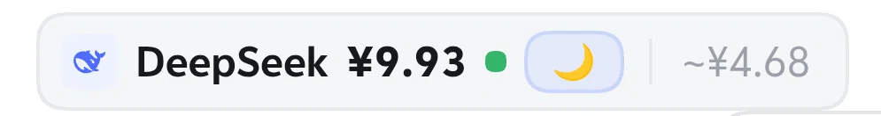
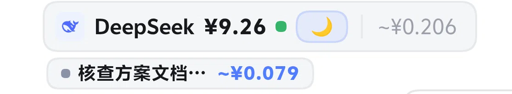
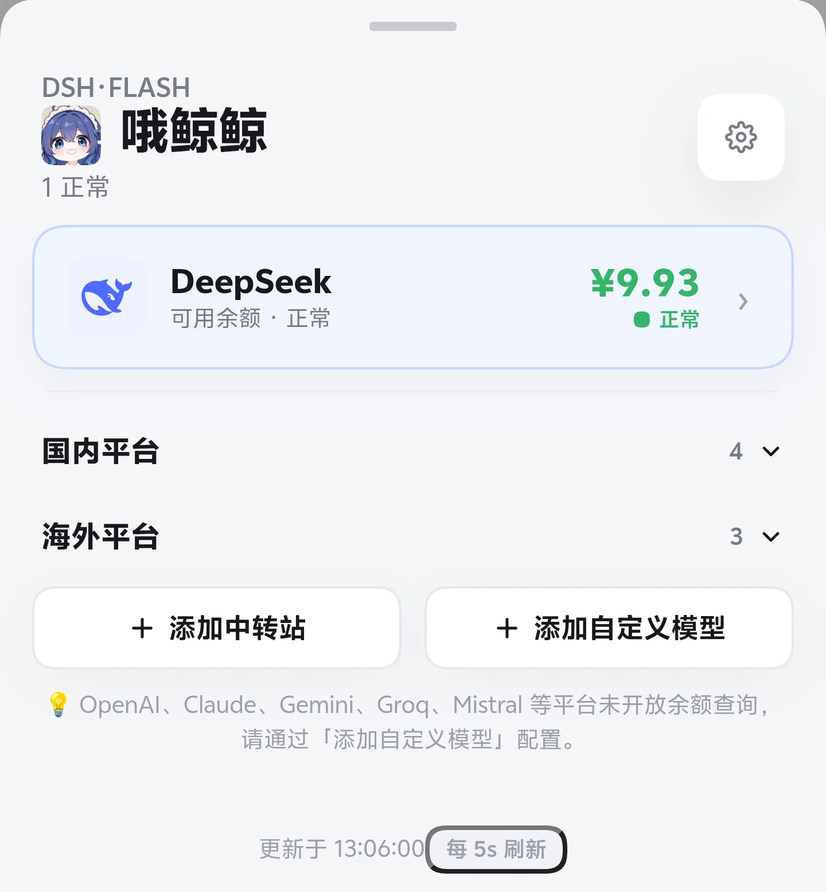
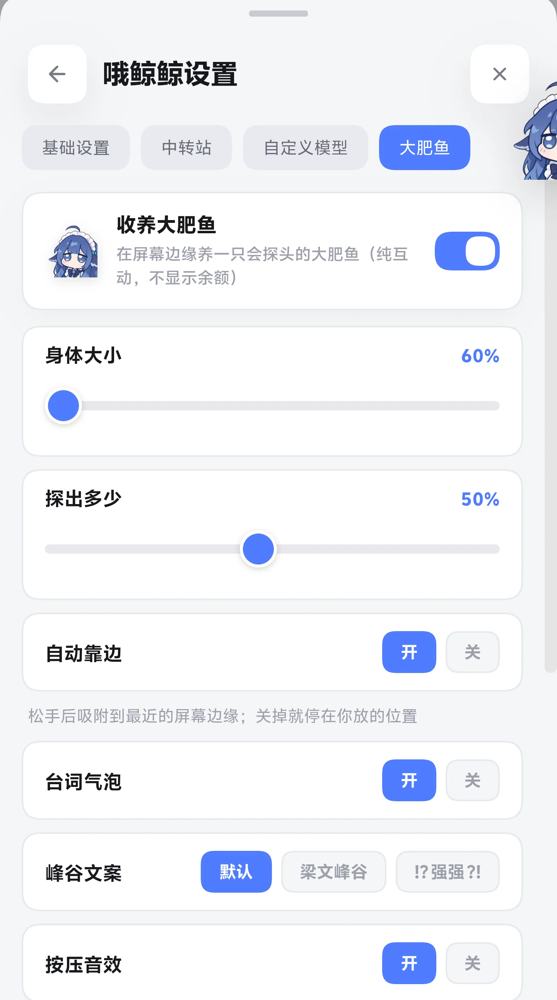
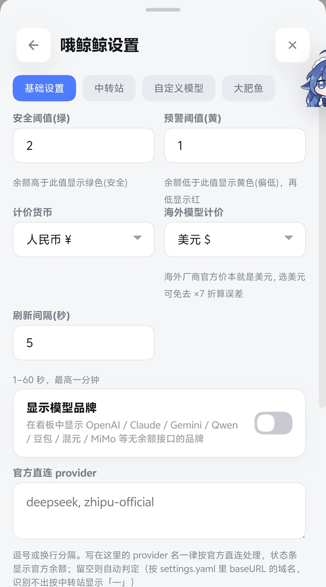
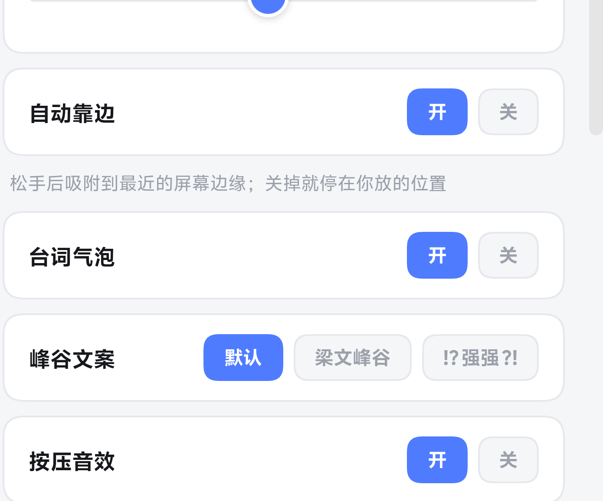

# dsh-api-dashboard · 哦鲸鲸

[](https://www.npmjs.com/package/dsh-api-dashboard)
[](LICENSE)

**开源**（MIT）的 **DeepSeek Harness 专用**插件：多平台 API 余额 / 用量看板 —— 在 Web GUI 输入框下方实时显示各平台余额与**本会话估算消耗**。

> ⚠️ **安装或维护本插件之前，请先读 [`AGENTS.md`](AGENTS.md)** —— 数据准确性红线、踩过的坑、安装姿势对照都在那里。
> 本插件深度绑定 DeepSeek Harness 的客户端与宿主 API，**只能在 DSH 里运行**（手机版 DSHA 与桌面版同框架）。

## 界面预览

**余额条**常驻在输入框下方；会话里有子代理时，下面会多一行**可横滑的消耗胶囊**（顺序 = 创建顺序，长按看详情）。

<a href="docs/screenshots/1-balance-bar.webp"></a>
<a href="docs/screenshots/2-subagent-row.webp"></a>

| 看板（点余额条打开） | 大肥鱼挂件（可拖拽 / 吸附边缘） |
|:---:|:---:|
|  |  |
| **设置 · 基础** | **设置 · 大肥鱼** |
|  |  |

## 功能

- **三层 UI**：状态条（输入框下方）→ 看板抽屉（点状态条）→ 平台详情（点卡片 ⓘ）
- **峰谷趣味计费**：DeepSeek 工作日 9:00-12:00 / 14:00-18:00 显示 ☀️ 梁文峰，其余时间与周末 🌙 梁文谷（半价）
- **三色阈值灯**：绿 / 黄 / 红，阈值可自定义；余额首次跌破预警线自动推送通知
- **一键去充值**：平台详情里直接打开该平台的开放平台 / 充值页。手机版走宿主桥调系统浏览器
  （GUI 在 webview 里，`window.open` 开不出外部浏览器），桌面 / 浏览器回退新标签页
- **会话消耗估算**：按模型单价折算；混合币种两段显示 `~¥3.40+$12.50`，**不做汇率折算合并**
- **子代理消耗**：子代理单独成行、可横滑，长按看完整详情
- **大肥鱼挂件**（可选）：屏幕边缘一只可拖拽的互动挂件，纯娱乐，不显示任何金额
- **自定义接入**：中转站自动探测余额接口；自建接口支持点分路径手动映射
- **配置持久化**：阈值 / 币种 / 刷新间隔（1~60 秒）/ 自定义条目都存本地状态文件，重启不丢
- **一键自更新**：设置面板内检查并安装新版本（下载 → 校验 → 备份 → 替换 → 失败回滚）

## 支持平台

| 分组 | 平台 |
|---|---|
| 国内 | DeepSeek、智谱 GLM、Kimi、阶跃星辰、硅基流动、MiniMax |
| 海外 | OpenRouter、Novita AI、xAI Grok |
| 其他 | 自定义中转站（自动探测余额接口）、自定义模型（手动映射） |

> OpenAI / Claude / Gemini / Groq / Mistral / Together 等**未开放余额查询接口**，面板会如实显示「未开放」，
> **不会伪造数字**。智谱按量付费账户同样没有公开余额接口（显示中性「未开放」，不标红）。

## 安装

### 手机版 DSHA（Android）—— 实测可用，照抄即可

```sh
# 1. 下载源码
curl -L "https://codeload.github.com/133563825as-ai/dsh-api-dashboard/tar.gz/refs/heads/main" \
     -o /tmp/dsh-api-dashboard.tar.gz

# 2. 解压到固定位置（--strip-components=1 必须带）
rm -rf /root/dsha-api-dashboard && mkdir -p /root/dsha-api-dashboard
tar xzf /tmp/dsh-api-dashboard.tar.gz -C /root/dsha-api-dashboard --strip-components=1

# 3. 建 node_modules 软链 —— 这一步不能省（插件的 peer 依赖由宿主 DSH 提供）
ln -sfn /usr/local/lib/node_modules/@deepseek-ai/dsh/node_modules /root/dsha-api-dashboard/node_modules

# 4. 用 link: 装进 web profile（文件保持真实路径，客户端 UI 才能被框架找到）
dsh plugin --profile web add link:/root/dsha-api-dashboard

# 5. 重启 dsh web
```

> 仓库根目录的 [`install.sh`](install.sh) 把上面 5 步做完了：`sh install.sh`。

**桌面版**同理（路径换成你自己的）。npm 一行命令 `dsh plugin --profile web add dsh-api-dashboard`
在桌面版通常可用，但在**手机版 DSHA 上装完客户端 UI 不会出现** —— 原因与逐条实测对照见
[`AGENTS.md`](AGENTS.md#二安装须知ai-代理注意)。

### 升级

1. 插件设置面板 →「检查更新」→「一键自更新」，重启 `dsh web` 生效；
2. 或重跑上面第 1、2 步覆盖源码目录后重启；
3. 或 `dsh plugin --profile web remove dsh-api-dashboard` 后重新安装。

## 配置

在设置面板里调即可（保存后写入 `~/.dsh/dsh-api-dashboard.json`）。
也可以直接写 `cordis.patch.yml`：

```yaml
- id: dsh-api-dashboard
  config:
    safeThreshold: 50        # 绿色阈值
    warnThreshold: 10        # 黄色阈值（低于它变红）
    currency: CNY            # 主计价货币
    overseasCurrency: USD    # 海外模型计价：follow | USD | CNY
    refreshIntervalMs: 300000
    clientPollIntervalMs: 30000
    timeoutMs: 8000
```

**API Key 自动读取**，无需写进配置：先查环境变量（`DEEPSEEK_API_KEY` / `ZHIPU_API_KEY` / `MOONSHOT_API_KEY` /
`STEPFUN_API_KEY` / `SILICONFLOW_API_KEY` / `MINIMAX_API_KEY` / `OPENROUTER_API_KEY` / `NOVITA_API_KEY` / `XAI_API_KEY`），
再查 DSH 凭证系统 `~/.dsh/.credentials.yaml`。

### 官方直连 / 中转站判定

状态条显示的是「官方余额」还是「—（中转站无余额接口）」，按三层判定，优先级从高到低：

1. **用户显式名单** —— 设置面板「官方直连 provider」，写进去的一律按官方；
2. **baseURL 域名** —— 服务端读 `settings.yaml` 的 provider `baseURL`，按**域名**比对官方端点白名单；没写 baseURL 的不表态；
3. **命名约定** —— 带 `-official` / `_official` 后缀的按官方。

三层都不命中默认按**中转站**处理（宁可不显示，也不显示错的余额）。设置面板会列出当前的自动判定结果。

## 安全

- API Key 只从环境变量 / DSH 凭证系统读取，**不写进代码或仓库**；
- `/api-dashboard/config` 返回的 Key 一律 `***`；浏览器端只请求同源接口，不向第三方域名发数据；
- 本地状态文件含自定义条目的 Key，权限 `0600`，被 `.gitignore` 排除；
- 自定义模型 / 中转站的 Key 会发往**你自己填的接口地址**，请只填信任的服务；
- v1.4.1 起插件路由带鉴权闸门（无 cookie → 401，跨域 → 403）。

## 开发

- 服务端 `src/index.js`（ESM，**零依赖、零构建**）；客户端 `client/client.js`（改完需重启 `dsh web`）
- 测试：`for f in test/*.mjs; do node "$f"; done`（退出码非 0 即失败）
- 改动红线、踩坑记录、发布流程：[`AGENTS.md`](AGENTS.md)、[`docs/RELEASING.md`](docs/RELEASING.md)

## 更新日志

最近一版 **v1.5.0** —— 🐋 大肥鱼挂件**音效引擎重做**（换成 Web Audio：预解码 + 同步起播 + 松手音 40ms 衔接，避开 macOS Touch Bar 播放条与「网络层拦请求导致静默无声」，保留 media element 回退）+ 音效组 2 → 4 组；并把**桌面 / 平板适配并入主线**（原 `preview/desktop` 分支：三档形态 —— 手机全宽 / 平板居中面板 / 桌面居中对话框、桌面档面板 720px + 卡片两列、`role="dialog"` 无障碍、宿主侧栏竖线抑制），统一为同一个正式版。（换成 Web Audio：预解码 + 同步起播 + 松手音 40ms 衔接，避开 macOS Touch Bar 播放条与「网络层拦请求导致静默无声」，并保留 media element 回退）+ 音效组 2 → 4 组。

上一版 **v1.4.6** —— 修 issue #2 的三个问题：**余额低于预警线不再叫「异常」**（查询正常但金额低 → 「不足」，真故障才叫「异常」）、**标题与卡片口径统一**（都走阈值分级，另补「需关注」汇总）、**余额告警改走 DSHA App 桥**（旧的两条通知通道在 DSH ≥ 0.1.5 上都不存在，告警一直被静默吞掉；现在拿不到通道也会在 `/api-dashboard/alerts` 里明示，可做可见降级）；并适配 DSH 0.1.7 的 provider 配置新位置（段落已迁进 profile 的 `cordis.patch.yml`），判定改为**白名单制**——拿域名（provider 自己写的 baseURL，或 DSH 内置目录给的默认地址）比对官方白名单，命中才算官方，其余一律按中转站；「官方但官方没开放余额接口」的那类不再被错分成中转站。上一版 **v1.4.5** —— 消耗估算口径三处修正：**峰谷改按「事件发生时刻」计价**（旧实现按「打开面板那一刻」，谷时跑的量在峰时查看会被翻倍）、**法定节假日全天算谷时**、**缓存写入按官方 ×125% 单独计价**；同时把十一家厂商的价格表逐条对官方原文重核，并补录 40+ 条新模型（GPT-6 Astra、Claude Fable 5.1、GLM-5.3-FlashX、MiniMax-M3、Gemini 3.5 Flash、Grok 4.7 / 4.6、MiMo V2.6 等）；另修「点设置抽搐一下」与刷新间隔 300 秒两处交互根因。一版一行的完整历史见 [`CHANGELOG.md`](CHANGELOG.md)。

## License

MIT —— 见 [LICENSE](LICENSE)。大肥鱼互动挂件移植自
[MeteorNOX/DeepSeek-Balance-Whale-Widget](https://github.com/MeteorNOX/DeepSeek-Balance-Whale-Widget)（MIT），
许可副本见 [`assets/whale/LICENSE-whale-widget.txt`](assets/whale/LICENSE-whale-widget.txt)。
